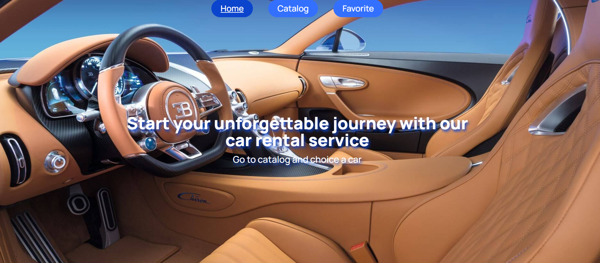

# Car Rental Application

## Опис проєкту

Цей проєкт реалізує веб-застосунок для компанії, що надає послуги з оренди автомобілів в Україні. Застосунок має три основні сторінки:

- Домашня сторінка: Містить загальний опис послуг, що надає компанія. Стилізація та оформлення виконано на розсуд розробника.

- Каталог автомобілів: Сторінка з каталогом автомобілів різної комплектації, які можна фільтрувати за маркою, ціною за годину оренди та кількістю кілометрів, пройдених автомобілем.

- Улюблені оголошення: Сторінка, на якій користувач може переглядати оголошення, які він додав до улюблених.

## Технічне завдання

- Реалізація карточки оголошення про здачу авто в оренду
- На першій сторінці каталогу відображаються 12 оголошень, а інші - після кліку на кнопку "Load more".
- Кнопка "серця" на карточці оголошення дозволяє додавати оголошення до списку улюблених, змінюючи колір кнопки.
- При оновленні сторінки фіксується кінцевий результат дій користувача.
- Повторне натискання на кнопку "серця" видаляє оголошення зі списку улюблених.
- Кнопка "Learn more" відкриває модальне вікно з детальною інформацією про авто та умови його оренди.
- Модальне вікно закривається по кліку на кнопку "хрестика", кліку на backdrop або натисканню на клавішу Esc.
- Пробіг авто виводиться через кому в UI (наприклад, 4,500).
- Кнопка "Rental car" реалізована як посилання, що дозволяє користувачу зʼєднатись з компанією за номером телефону +380730000000.
- Реалізована фільтрація за маркою автомобіля та пагінація на стороні Mockapi.
- Роутинг

### Використано React Router з наступними маршрутами:

/ - домашня сторінка з загальним описом послуг компанії.
/catalog - сторінка з каталогом автівок різної комплектації.
/favorites - сторінка з улюбленими оголошеннями.
Якщо користувач зайшов за неіснуючим маршрутом, його перенаправляють на домашню сторінку.

## Бекенд

Для роботи зі списком оголошень використовується власний бекенд, побудований на основі UI-сервісу Mockapi. Створено ресурс adverts з об'єктом оголошення, як описано в технічному завданні.

##Додаткове завдання

- Фільтрація за маркою автомобіля з використанням dropdown.
- Dropdown з цінами за годину оренди (крок 10$) для фільтрації оголошень.
- Група input для визначення діапазону пробігу автомобіля.
- Критерії виконання
- Верстка фіксована в рх, семантична та валідна.
- Використано Redux для управління станом.
- Для запитів використовується бібліотека Axios.
- Пагінація реалізована на бекенді.
- Відсутність помилок у консолі браузера.
- Інтерактивність працює відповідно до технічного завдання.
- Код відформатовано та не містить невикористаного коду.
- Репозиторій має README.md з описом проєкту.
- Проєкт задеплоєний на GitHub Pages або Netlify.
